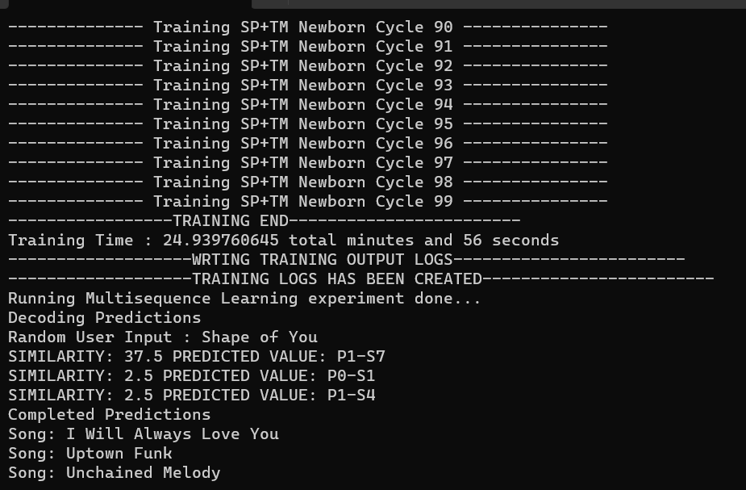

# Song recommendation by using Hierarchical Temporal Memory

## What is the experiment about?
-------------

In today’s social media world, you as a business expert you want to maximise the time that your music playing application is being used, be it in foreground or background. To maximise the use you want the user to keep playing music and to do so the music which is being played must be in best of user interest/choice/liking. So with neocortexapi, we are going to build a ‘playlist recommendation application’ which helps you to recommend such a music which look at your current music playlist and recommends you upcoming song or a whole playlist. This way we not only keep on playing music which is in best interest of user but also increase the time that the application is being used.

## Data Structures used?
-------------

1. Basic data structure of a `Song`

~~~csharp
public class Song
{
    public String Name { get; set; }     // Name of the song
    public String Singer1 { get; set; }  // Singer1 of the song
    public String Singer2 { get; set; }  // Singer2 of the song
    public String Genre1 { get; set; }   // Genre1 of the song
    public String Genre2 { get; set; }   // Genre2 of the song
    public String Mood { get; set; }     // Mood of the song
}
~~~

2. `Playlist` is a list of song with plalist name

~~~csharp
public class Playlist
{
    public String Name { get; set; }      // Name of playlist
    public List<Song> Songs { get; set;}  // List of songs
}
~~~

3. `ScalarSong` is scalarized datastructure of `Song`

~~~csharp
public class ScalarSong
{
    public int Name { get; set; }
    public int Singer1 { get; set; }
    public int Singer2 { get; set; }
    public int Genre1 { get; set; }
    public int Genre2 { get; set; }
    public int Mood { get; set; }
}
~~~

4. `ScalarModel` is used to have 1-to-1 mapping of each `Song` to `ScalarSong`

~~~csharp
//equivalent to song class
public class ScalarModel
{
    public int Id { get; set; }
    public Song Song { get; set; }
    public ScalarSong ScalarSong { get; set; }
}
~~~

5. `PlaylistScalarModel` is list of `ScalarModel`

~~~csharp
//equivalent to playlist class
public class PlaylistScalarModel
{
    public String Name { get; set; }
    public List<ScalarModel> ScalarModelList { get; set; }
}
~~~

6. `Database` is list of each entity of a `Song`. Each entry in the list is unique.

~~~csharp
public class Database
{
    public Dictionary<string, int> SongNames = new Dictionary<string, int>();
    public Dictionary<string, int> Singers = new Dictionary<string, int>();
    public Dictionary<string, int> Genres = new Dictionary<string, int>();
    public Dictionary<string, int> Moods = new Dictionary<string, int>();
}
~~~

## How is it implemented?
-------------

Before we come to implementation, let see how our dataset is and what it consists of?
Below is a sample input dataset.
~~~json
[
  {
    "Name": "Shape of You",
    "Singer1": "Ed Sheeran",
    "Singer2": "",
    "Genre1": "Pop",
    "Genre2": "",
    "Mood": "Energetic"
  },
  {
    "Name": "Uptown Funk",
    "Singer1": "Mark Ronson",
    "Singer2": "Bruno Mars",
    "Genre1": "Funk",
    "Genre2": "Pop",
    "Mood": "Groovy"
  },
  {
    "Name": "Bohemian Rhapsody",
    "Singer1": "Queen",
    "Singer2": "",
    "Genre1": "Rock",
    "Genre2": "",
    "Mood": "Epic"
  }
]
~~~

As you see it is generally and list of `Song` class.

Below is the implementation of song recommendation program:

  1. Reading playlists

      As seen above is the sample input json object. We have such multiple playlist in the json file. We read the whole json file into `List<Songs>` and give an name to playlist thus creating a `Playlist`. When we read all the dataset files we end up with `List<Playlist>`.

  2. Filling database

      To fill the database we need to traverse each song in the playlist and extract unique values of song name, singer, genre and mood of the song. This isn't a relational database but as seen above it's and class of multiple dictornaries containing key as name and scalar value as data. `Database` plays an important data structure since it easily retives scalar values, helps in encoding, and decoding output from algorithm.

  3. Scalarizing values

      This method fills the `ScalarSong` which is used by `ScalarModel` this helps to have 1-to-1 mapping of all attributes of songs and its scalar value as per `Database`. In this way we map all string values to numeric value.

  4. Getting song encoder

      Once we have the unique number of attributes of a song, we know the max possible number in an attribute. So we can dynamically assign values in our `ScalarEncoder`.

  5. Encoding playlists

      The encoder and scalar values are turned into SDR values using respective `ScalarEncoder`.

  6. Running multisequence learning alogrithm

      Here the we create a relationship between and SDR and KEY which relates to the sequence of a song. 
      
      Below is the pseudocode for the algorithm:

```
01. Get HTM Config and initialize memory of Connections 
02. Initialize HTM Classifier and Cortex Layer
03. Initialize HomeostaticPlasticityController
04. Initialize memory for Spatial Pooler and Temporal Memory
05. Add Spatial Pooler memory to Cortex Layer
	05.01 Compute the SDR of all encoded segment for Multi-sequences using Spatial Pooler
	05.02 Continue for maximum number of cycles
06. Add Temporal Memory to Cortex Layer
    06.01 Compute the SDR as Compute Cycle and get Active Cells
	06.02 Learn the Label with Active Cells
	06.03 Get the input predicted values and update the last predicted value depending upon the similarity
	06.04 Reset the Temporal Memory
	06.05 Continue all above steps for sequences of Multi-sequences for maximum cycles
07. Get the trained Cortex Layer and HTM Classifier
```

  7. Getting prediction

      The key learned while running the experiment is the predicition result which you we get. 

      e.g.: P4-3-8-9-7-4-6 which means playlist4-song3-song8-song9-song7-song4-song6 and the '-' denotes followed by in the playlist.

      Thats how we remember the sequence of the song in the playlist and reverse map it when the key is predicted.

      e.g.: For above example to be predicted the input song would have been song4 which will be followed by song6 and final prediction would be with maximum similarity in SDRs of playlist4 having sequence of song3-song8-song9-song7-song4

## Result and improvement
-------------

### Sample output from experiment



Key created from the song in a playlist holds significance important for learning the sequence. So each playlist is given a unique name and each song hold a unique entry in `Database`. The key is created by as `{Playlist.Name}-{Song1}-{Song2}-{Song3}-{Song4} and so on` adding the song at end of key and learn with a SDR of a last song in the key.

Once the learing part is done, a song is selected at random from a random playlist and prediction is executed. On the result of the prediction, the key is mapped back after looking in `Database` and songs are displayed. 

### Improvement

1. Consider null value while learning

    When we consider null values for each attribute, we add one more tuple and this can be filled when we do not know the value or the value is actually null.

    eg: Usually a song has primary singer and secondary singer but not all songs have them, so in such cases we can will secondary singer a null and consider singer 2 as attribute while learning

2. Consider all significant possible parameters for inputs

    This improvement comes from the previous improvement where null values should be filled with a data, this helps to use new attribute while learing.

    eg: Usually a song has primary singer and secondary singer but not all songs have them, so in such cases we can will secondary singer a null and consider singer 2 as attribute while learning

3. Create larger dataset to improve input sequences

    Size of the dataset has always been an significant challenge to deal with. There are couple of ways to tackle it
    
    a. Synthetic data
    
      One can create the playlist by randomly choosing songs from large data set of a song. The down side to this is that the learning alogrithm ends up learing the randomness of data instead of real world realtionship between two songs.

    b. Scrapping data

      This one of the easy method where web scrappers scan be used to scrape the playlist from music related web application hosted online. To make it even more quick, one can request playlists from generative AI.

    c. Data from user

      This method is most genuine method and most time consuming too. Here we need to gather data from realtime users where in the user creates their own playlist in application and we add that data while continous learning. 

## References
-------------
a. [NeoCortexApi](https://github.com/ddobric/neocortexapi)

b. [Hierarchical Temporal Memory (HTM) Whitepaper](https://numenta.com/neuroscience-research/research-publications/papers/hierarchical-temporal-memory-white-paper/)

c. [Encoding Data for HTM Systems](https://arxiv.org/abs/1602.05925)

d. [Properties of Sparse Distributed Representations and their Application to Hierarchical Temporal Memory](https://arxiv.org/abs/1503.07469)

e. [A thousand brains: toward biologically constrained AI](https://link.springer.com/article/10.1007/s42452-021-04715-0)

f. [The HTM Spatial Pooler—A Neocortical Algorithm for Online Sparse Distributed Coding](https://numenta.com/neuroscience-research/research-publications/papers/htm-spatial-pooler-neocortical-algorithm-for-online-sparse-distributed-coding/)
